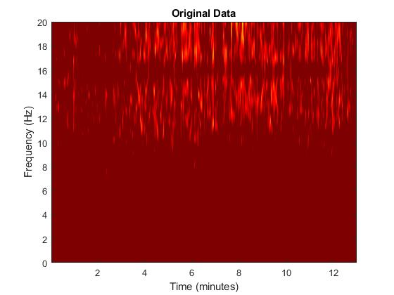
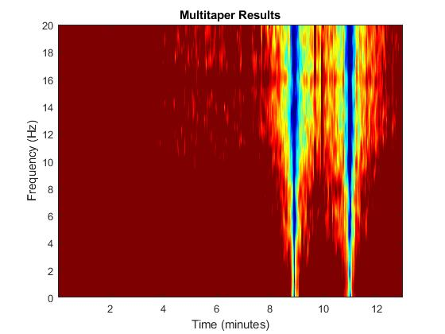
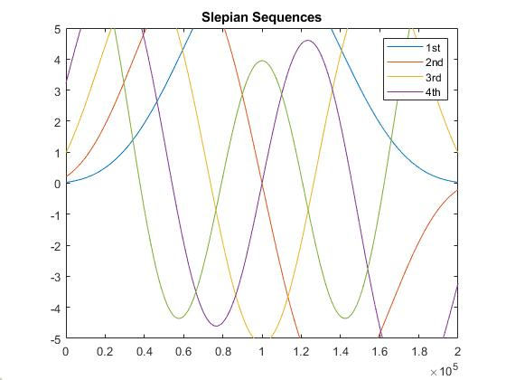

# About
This Projet is an implementation of Multi-taper Spectral analysis in matlab. [Learn More](https://pubmed.ncbi.nlm.nih.gov/24759284/)

if you want to try it clone the folder with
```bash
git clone https://github.com/Sean-Borneman/MultitaperSpectralAnalysis.git
```
and run [LetsTryMultiTapringv2.m](LetsTryMultiTapringv2.m)
# Filter Library
The [FilterlIBRARY.m](FilterlIBRARY.m) script is a collection on matlab filters (bandpass, bandstop, hilbert, etc.) that i've documented and filled out so their easy to use later. I mainly use it as a **Referance** for when I need to implement differant filters in a script because while Matlabs documentation is great it can take a while to read through and figure out which variables are which. 
# Results
Below is an example of the analysis results




And here we can see the sepian sequences used



